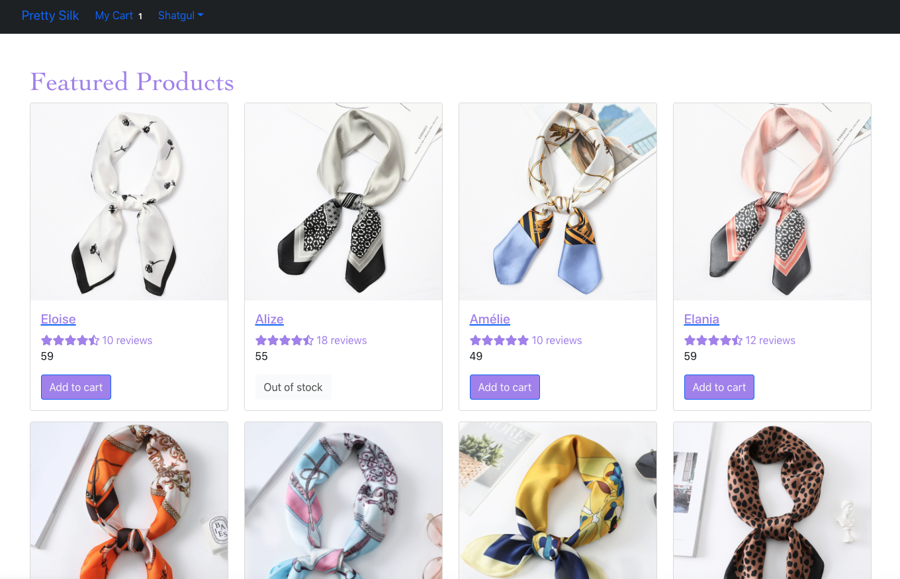

# PrettySilk

[Live site](https://pretty-silk.herokuapp.com/)

E-commerce site for purchasing and selling feminine, elegant and stylish products that are made from 100% pure silk.
This is a ongoing project that will be build into an e-commerce site which will include 10 main features

Main features:

-   Manage customers
-   Manage sellers
-   Manage products:
    -   upload multiple images for products
    -   search box for products
    -   sort and filter
-   Manage cart & checkout
-   Manage payments
-   Manage store with store analysis
-   Manage reviews from users
-   Manage discounts(marketing side)
-   Mangage emails: send email order receipt and subscriptions
-   Manage chatbox for live chat support

---

# Tech Stack

The site is built using the MERN(MongoDB Express React.js Node) stack:

-   Mongo DB - NoSql DB
-   Mongoose - Node. js-based Object Data Modeling (ODM) library for MongoDB
-   Express - Backend server
-   NodeJS - Node.js Backend
-   React - Frontend JavaScript framework
-   React Bootstrap - Frontend

---

# User Stories

Sara loves silk and she is up to shopping as a customer:

-   Sara can select, add, edit, and delete products, which lead to shipping and payment pages
-   Sara will be able to rate and review the products that she purchased
-   Sara will be able to receive online live chat support
-   Sara will have access to her own order history

Sara loves it so much so that she decides to become an entrepreneur and begin her small bussiness:

-   Sara will be able to add, edit, and delete products on the seller system
-   Sara will be able to list all customers(users), edit, and delete their accounts
-   Sara will be able to edit, and delete product reviews on the seller system
-   Sara will be able to track on businness through analysis platform on the seller system
-   Sara can email her customers who subscriped to her businness
-   Sara can create, edit(such as start date and expiration date), and delete a coupon for her bussiness to boost sells

# Wireframes and screenshots

-   Landing Page:

-   Product Page:

-   Shopping Cart Summery:

---

# Roadmap

## Near-Term

-   Finalize the customer sides: add sign up page; shipping and place order pages
-   Add customer order history page
-   Create Search product page
-   Add rate and review pages
-   Implement admin pages: list, edit, delete users;

## Long-Term

-   Implement admin pages: send auto-order receipt email and handle subscription emails;
-   Add chatbox live support
-   Add discount code functionality from seller perspective
-   Add OpenID to allow using credentials from Gmail, Facebook or Twitter
-   Add multi-factor auth for enhanced security
-   Add store analysis capabilities with graph visualizations
-   Add multi-seller platform
-   Court check-in
